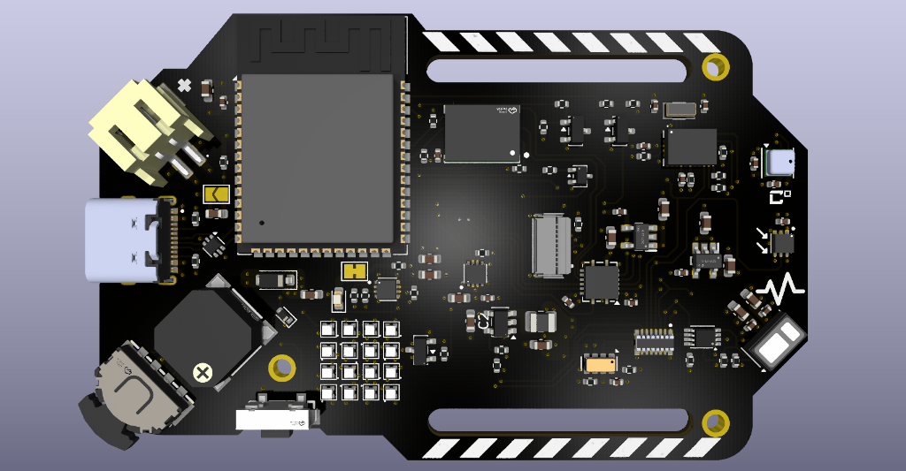
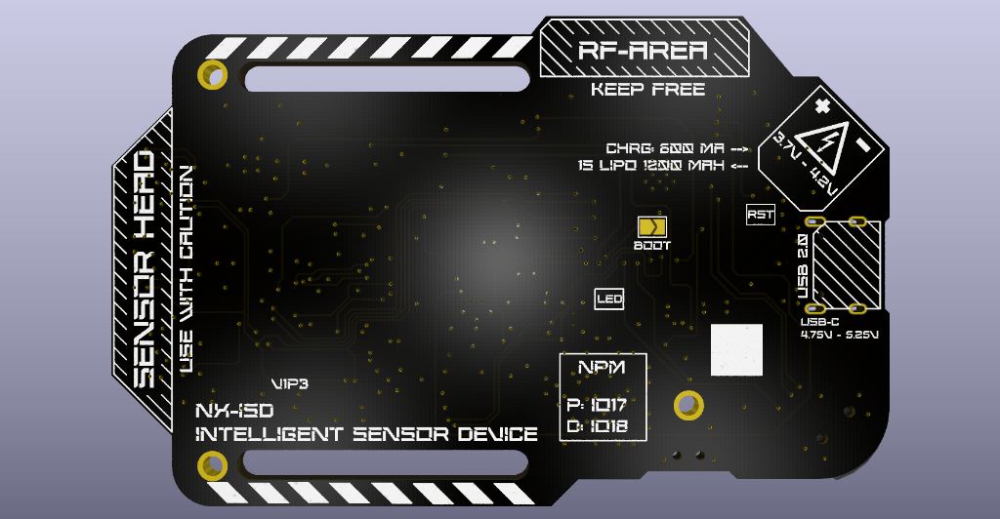

# NX-ISD

## Overview
The **NX-ISD** is a custom, highly integrated wearable and embedded development board inspired by the Artemis Watch. It serves as the hardware foundation for the **ISD-Core** operating system.

<p align="center">
  
  
</p>
<p align="center">
  <em>NX-ISD Hardware Revision v1p3 (KiCad Raytraced 3D Render) — No Battery & No Display mounted</em>
</p>

## Naming & Structure

```text
N X - I S D
│     │
│     └─► Intelligent Sensor Device
│         (The hardware foundation)
│
└─► Prototyping Series
    (Always in development, not a closed product, open for everyone)

      │
      ▼
  ISD-Core
      │
      ├─► Custom Operating System (Dual-Core FreeRTOS based)
      ├─► Built on PlatformIO / Arduino Framework
      │
      ├──► NX-MSF: Mathematical Sensor Fusion (Physics Models & Kalman Filters)
      ├──► NX-AIS: Advanced Information System (Contextual Advisory Engine)
      └──► NX-SDS: Self-Diagnostic System (Hardware Integrity & Proof-Testing)
```


## Hardware Specifications

### Core & Storage
* **Microcontroller:** ESP32-S3 N16R8
* **Storage:** Additional Onboard NAND-SD (ZDSD02GLGEAG -> 2 Gbit = 250 MByte)

### Sensors
* **Motion/IMU:** BNO085 (9-DOF Motion Co-Processor)
* **Environment:** BME690 (Temperature, Humidity, Pressure, Gas)
* **Ambient Light:** OPT3001
* **Biometrics:** MAX30102 (Heart Rate / SpO2)
* **Timing:** RV-3028-C7 Real-Time Clock (RTC)

### Power Management
* **Charging:** USB-C (BQ25170 LiPo Charger, 1200mAh form factor)
* **Monitoring:** MAX17048 Fuel Gauge
* **Voltage Regulation:** Synchronous step-down buck converter (TLV62568, ~95% efficiency) for 3.3V system rail; dedicated low-noise LDOs (RT9193-18GB/28GB) for 1.8V and 2.8V sensor rails

### Peripherals & I/O
* **Display:** 10-Pin 0.5mm FPC connector for SPI displays
* **LEDs:** 16x WS2812B NeoPixel 4×4 Serpentine Matrix (XL-1010RGBC) with PMOS high-side power cutoff
* **Audio:** Onboard SMD Buzzer
* **Input:** Multi-Directional Lever-Switch and Push-Button

## Software & Core Systems
The board is programmed via **PlatformIO** (Arduino Framework) and is optimized to run the custom **ISD-Core** operating system. The software stack is composed of core modular subsystems:

* **[ISD-Core](ISD-Core/):** The dual-core FreeRTOS operating system handling task scheduling (Core 1 UI @ ~42Hz, Core 0 Sensors @ 50Hz/1Hz), thread-safe `SensorState` telemetry, 3D Cover Flow launcher, 360° radial dials, and smoothstep backlight transitions. See [`ISD-Core/README.md`](ISD-Core/README.md) for the software architecture and [`ISD-Core/MANUAL.md`](ISD-Core/MANUAL.md) for the complete user manual.
* **Persistent Storage Subsystem (`StorageManager`):** Manages non-volatile configuration storage on the onboard 2 Gbit ZDSD NAND Flash (`CS_SD = GPIO 47`). Stores a 64-byte packed binary struct (`/sys/config.bin`) with CRC-16 validation and a zero-wear save policy (writes occur only on user confirmation/exit, never while dialing).
* **Configuration Tooling (`tools/nx_config_tool.py`):** Standalone Python CLI utility to inspect, validate, dump to JSON, and compile binary config files offline for testing and flashing.
* **NX-MSF (Mathematical Sensor Fusion):** The analytical physics and math engine executing 1D Kalman filter variometer tracking, Magnus-Tetens dew point calculation, barometric storm gradients, RMSSD heart rate variability, and software energy accounting.
* **NX-AIS (Advanced Information System):** The autonomous on-device contextual advisor translating raw multi-sensor telemetry into proactive health, environmental, and tactical notifications.
* **NX-SDS (Self-Diagnostic System):** The internal hardware integrity and health assurance engine providing continuous I2C bus recovery, on-demand in-situ proof-testing, and predictive battery/sensor aging analytics.

## Documentation & Manuals
* **User & Navigation Manual:** [`ISD-Core/MANUAL.md`](ISD-Core/MANUAL.md) — Comprehensive guide covering physical controls, screen layouts, the 6 core application decks, 360° radial dials, and storage persistence.
* **Architecture & Hardware Guide:** [`ISD-Core/README.md`](ISD-Core/README.md) — Technical operating system internals, pin maps, and PlatformIO build instructions.
* **Hardware & PCB Specifications:** [`ISD-PCB/README.md`](ISD-PCB/README.md) — Revision v1p3 schematics, power budgets, layer stackup, and BOM.
* **Features & Math Modeling Roadmap:** [`FEATURE_LIST.md`](FEATURE_LIST.md) — Technical specifications, mathematical formulas, and implementation roadmap.
* **Software Roadmap & TODOs:** [`ISD-Core/SW-TODO.md`](ISD-Core/SW-TODO.md) — Core application deck progress and feature checklist.

## License
The software/firmware in the [ISD-Core] directory is licensed under the GNU General Public License v3.0 (GPLv3).

The hardware design files in the [ISD-PCB] directory are licensed under the CERN Open Hardware Licence Version 2 - Strongly Reciprocal (CERN-OHL-S).
